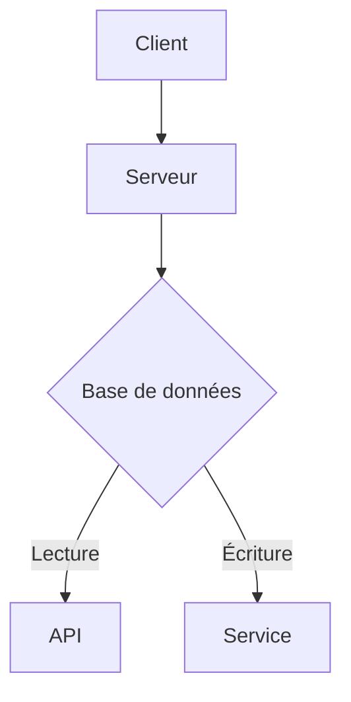
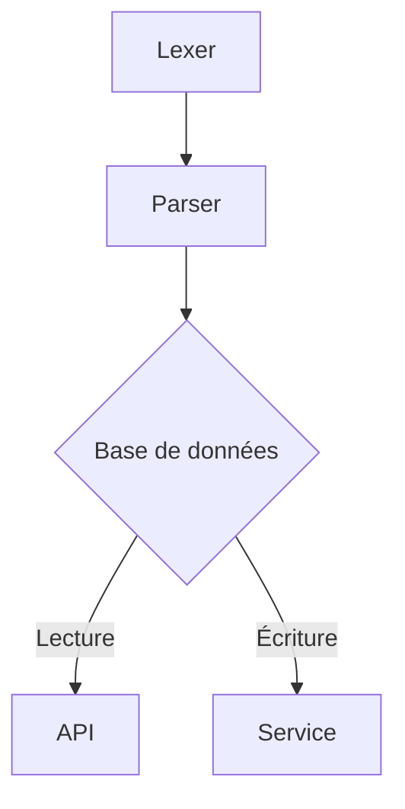

# Architecture du Code mermaid

```mermaid
graph TD;
    A[Client] --> B[Serveur];
    B --> C{Base de données};
    C -->|Lecture| D[API];
    C -->|Écriture| E[Service];
```

# Architecture du Code mermaid

```mermaid
graph TD;
    A[Lexer] --> B[Parser];
    B --> C{Base de données};
    C -->|Lecture| D[API];
    C -->|Écriture| E[Service];
```

